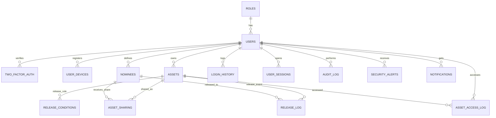

# Asthipathra ER Diagram (Schema Form)

All tables are in 3NF:
- Master entities (`USERS`, `ASSETS`, `NOMINEES`) keep only direct attributes.
- Relationship tables (`ASSET_SHARING`, `RELEASE_LOG`) separate many-to-many or event data.
- Logging/security tables are isolated for auditability and low coupling.
